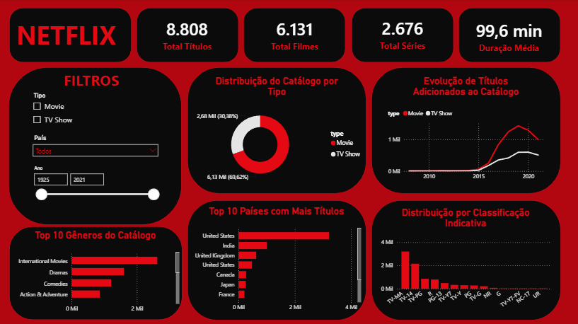

# Análise de Dados do Catálogo Netflix

Projeto de análise de dados desenvolvido com Python e Power BI, utilizando dados do catálogo da Netflix.

O objetivo do projeto foi praticar o processo de análise de dados, passando pela exploração e tratamento dos dados em Python até a criação de um dashboard interativo no Power BI.

## Tecnologias utilizadas

- Python
- Pandas
- Jupyter Notebook
- Power BI
- Git e GitHub

## Estrutura do projeto

- `data/` → arquivos utilizados na análise
- `notebooks/` → análise e tratamento dos dados em Python
- `dashboard/` → dashboard desenvolvido no Power BI
- `images/` → imagens do dashboard
- `requirements.txt` → bibliotecas Python utilizadas no projeto

## Tratamento dos dados

Antes da criação do dashboard, os dados foram explorados e tratados utilizando Python e Pandas.

Durante essa etapa foram realizadas:

- análise inicial da estrutura do dataset;
- identificação e tratamento de valores ausentes;
- conversão e ajuste de tipos de dados;
- tratamento da coluna de duração dos títulos;
- separação de informações de gêneros e países para facilitar as análises;
- criação de dados preparados para utilização no Power BI.

## Análise dos dados

Após o tratamento, os dados foram analisados para compreender melhor a composição e a evolução do catálogo da Netflix.

Entre as análises realizadas estão:

- quantidade total de títulos disponíveis;
- comparação entre filmes e séries;
- evolução da quantidade de títulos adicionados ao catálogo ao longo dos anos;
- gêneros mais presentes no catálogo;
- países com maior quantidade de títulos;
- distribuição dos títulos por classificação indicativa;
- análise da duração média dos filmes.

## Dashboard no Power BI

Os dados tratados foram utilizados para desenvolver um dashboard interativo no Power BI.

O dashboard permite explorar as informações por meio de filtros de tipo de conteúdo, país e ano, possibilitando analisar diferentes características do catálogo de forma dinâmica.

### Principais indicadores

- **8.808** títulos
- **6.131** filmes
- **2.676** séries
- **99,6 min** de duração média dos filmes

## Visualização do Dashboard

## Principais insights

A análise dos dados permitiu identificar alguns padrões no catálogo da Netflix:

- Filmes representam a maior parte do catálogo, correspondendo a aproximadamente 70% dos títulos.
- Os Estados Unidos aparecem como o país com maior quantidade de títulos no catálogo.
- Gêneros relacionados a filmes internacionais e dramas estão entre os mais presentes.
- Houve um forte crescimento na quantidade de títulos adicionados ao catálogo principalmente a partir de 2016.
- A duração média dos filmes presentes no catálogo é de aproximadamente 100 minutos.

## Aprendizados

Durante o desenvolvimento deste projeto, foram praticados conceitos importantes de análise de dados, incluindo:

- manipulação e tratamento de dados com Pandas;
- identificação e tratamento de valores ausentes;
- transformação e preparação de dados para análise;
- criação e interpretação de visualizações;
- construção de medidas e indicadores no Power BI;
- criação de relacionamentos entre tabelas;
- desenvolvimento de filtros e interações entre visuais;
- organização de um dashboard com foco em clareza e facilidade de interpretação;
- organização de um projeto de dados para publicação no GitHub.